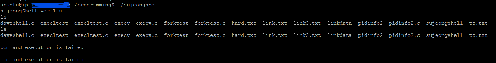

### Comile with gcc

```
 $gcc sujeongShell.c -o sujeongShell
 $ ./sujeongShell
```
_____________________
### Demo




__________________

### Exec() systemcall study


- execlp()
    - 파일 이름만 넘겨주면 process evironment variable 에서 exe(실행파일) 검색
- *execl()*
    - 파일명을 전체경로 포함 넘겨줌
- execle()
    - 환경변수(PATH 포함 가능)을 별도로 정의해서 넘겨주어야 함
        * 
###### (출처 : 제로베이스 컴퓨터 공학 따라잡기 완주반 강의)